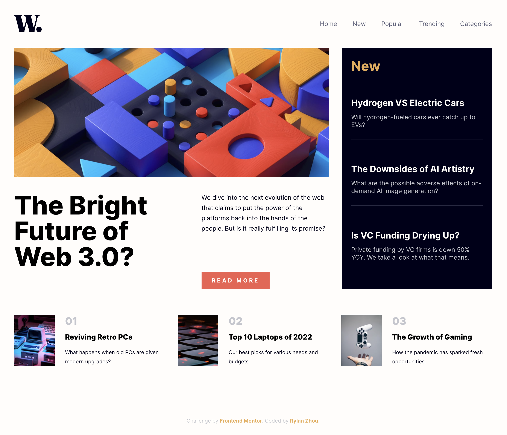

# Frontend Mentor - News homepage solution

This is a solution to the [News homepage challenge on Frontend Mentor](https://www.frontendmentor.io/challenges/news-homepage-H6SWTa1MFl). Frontend Mentor challenges help you improve your coding skills by building realistic projects.

## Table of contents

- [Overview](#overview)
  - [The challenge](#the-challenge)
  - [Screenshot](#screenshot)
  - [Links](#links)
- [My process](#my-process)
  - [Built with](#built-with)
  - [What I Implemented](#what-i-implemented)

## Overview

### The challenge

Users should be able to:

- [x] View the optimal layout for the interface depending on their device's screen size
- [x] See hover and focus states for all interactive elements on the page
- [x] **Bonus**: Toggle the mobile menu (requires some JavaScript)

> ⚠️ When toggling mobile mode on Chrome in developer tools, please refresh to load mobile layout.

### Screenshot



### Links

- Solution URL: [Github](https://github.com/RylanZhou/frontend-mentor-news-homepage)

- Live Site URL: [Vercel](https://frontend-mentor-news-homepage-gules.vercel.app/)

## My process

This is the first challenge I take from frontend-mentor. Given that it is a static page rather than it could load and display dynamic data, I used the most basic frontend techniques without any modern frameworks and hard coded all the text in html. It is still a very good challenge to hone the fundamental frontend skills and tricks.

In the `style.scss` file, I mostly used element selectors instead of class selector since there are only a few elements in each section, and they have relatively clear layouts.

### Built with

- Semantic HTML5 markup
- Sass
- CSS custom properties
- CSS Grid
- Typescript

### What I Implemented

1. To deal with mobile screen size, `100vh` will cause part of the content to be masked by mobile browser's headers and footers. Use customized css property `--height` to set container's height.

```js
// main.ts
window.onresize = () => {
  if (mobile()) {
    document.documentElement.style.setProperty('--height', window.innerHeight + 'px');
  }
};
```

```css
/* styles.scss */
body {
  height: var(--height);
}
```

2. Use `grid-template-area` on container element, and `grid-area` on child elements to better control element layout.

```css
.container {
  grid-template-area:
    'a a b'
    'a a b'
    'c c c';
}

.child-a {
  grid-area: a;
}

.child-b {
  grid-area: b;
}
```
